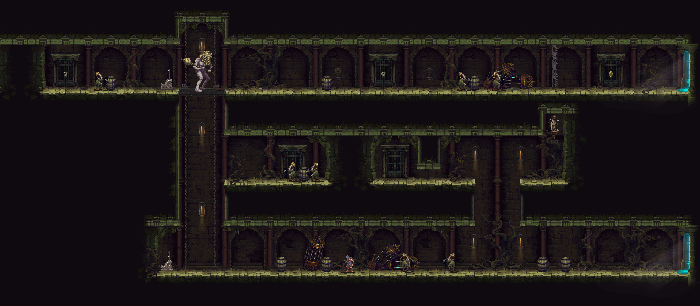

# Blasphemous Map Exporter

---

## Features
- Can export pictures of in-game rooms such as this one

## How to use
1. Enter a room
1. Use the mapexport commands to setup the parameters for the room
1. Leave that room
1. Use the load command to enter screenshot mode in that room
1. Move the camera around and press "-" to take a screenshot
1. Press "=" to exit screenshot mode

## Good practices
1. Use the lower left door if possible for the door data
1. Only turn delay on if there is a breakable wall that needs it for the delay data
1. Use F3 to move to the corners and then wait for the camera to stop moving for the bounds data
1. Take all screenshots on an empty save, so that everything is as original as possible
1. The exception to this is breakable walls, these should already be cleared
1. Bosses will probably have to be killed first to obtain the room bounds, but screenshots should then be taken on a new save
1. Stand near to the room before loading it in screenshot mode, otherwise the parallax will be weird

## Available commands
- Press "\\" to open the debug console
- Type the desired command followed by the parameters all separated by a single space

| Command | Parameters | Description |
| ------- | ----------- | ------- |
| `me load` | ROOM_NAME | Loads the room and enters screenshot mode |
| `me door` | none | Updates the door property for this room |
| `me delay` | on / off | Updates the delay property for this room |
| `me min` | none / x / y | Updates the xmin and/or ymin property for this room |
| `me max` | none / x / y | Updates the xmax and/or ymax property for this room |

## Installation
This mod can be cloned and built using Visual Studio  
Required dependencies:
- [Modding API](https://github.com/BrandenEK/Blasphemous.ModdingAPI)
- [Cheat Console](https://github.com/BrandenEK/Blasphemous.CheatConsole)
